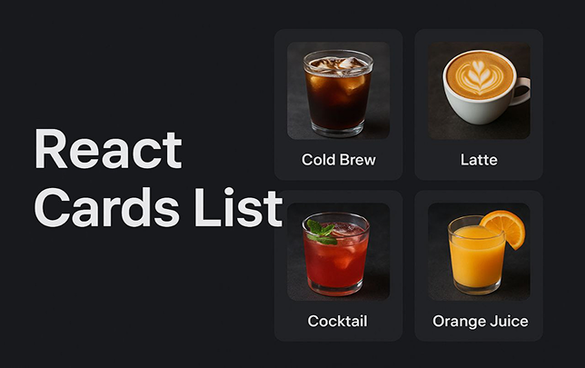

<div align="center">
  
  <br />
    
  <br />

  <div>
    
    
    
    
  </div>

  <h3 align="center">A Card List Application</h3>

  <div>
    Card List is a lightweight and flexible React application for displaying dynamic card-based layouts. Perfect for portfolios, product showcases, blog previews, or any content that benefits from a visually organized card interface.
  </div>

</div>

## 📋 <a name="table">Table of Contents</a>

1. 🤖 [Introduction](#introduction)
2. ⚙️ [Tech Stack](#tech-stack)
3. 🔋 [Features](#features)
4. 🤸 [Quick Start](#quick-start)
5. 🔗 [Usage Examples](#usage-examples)

## <a name="introduction">🤖 Introduction</a>

React Cards List is an interactive React web application that allows users to view, search, and add drink cards.
The project demonstrates working with components, state, and dynamic rendering using a modern frontend stack.
It’s great as a learning or demo project for beginner React developers.

## <a name="tech-stack">⚙️ Tech Stack</a>

- ⚛️ React 19 — UI library

- 🧩 Vite — build tool and dev server

- 💅 CSS Modules for styling

- 🌙 ThemeButton — theme switcher

- ✅ ESLint — for clean and consistent code

- 🔧 JavaScript (ES6+)

- 🧠 React Hooks & HOC

## <a name="features">🔋 Features</a>

🔍 **Search drinks by name**

➕ **Add new drink cards**

🌗 **Toggle between light and dark theme**

📋 **View drink list with images**

🧱 **Modular React component architecture**

and many more, including code architecture and reusability.

## <a name="quick-start">🤸 Quick Start</a>

Follow these steps to set up the project locally on your machine.

**Prerequisites**

Make sure you have the following installed on your machine:

- [Git](https://git-scm.com/)
- [Node.js](https://nodejs.org/en)
- [npm](https://www.npmjs.com/) (Node Package Manager)

**Cloning the Repository**

```bash
git clone https://github.com/AQozos/react-cards-list.git
cd react-card-list

```

**Installation**

Install the project dependencies using npm:

```bash
npm install
```

**Running the Project**

```bash
npm run dev
```

Open [http://localhost:5173](http://localhost:5173) in your browser to view the project.

## <a name="usage-examples">💡 Usage Examples</a>

After starting the project:

1. Type a drink name in the search bar — only matching drinks will appear.

2. Click “Add Drink” to create a new card.

3. Use the theme toggle button to switch between dark and light modes.
